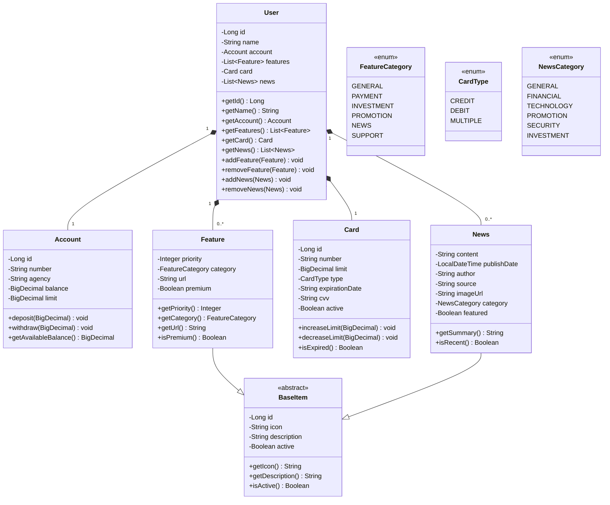

# Decola Tech 2025

Java RESTful API criada para o Decola Tech 2025.

## Principais Tecnologias
 - **Java 17**
 - **Spring Boot 3**
 - **Spring Data JPA**
 - **OpenAPI (Swagger)**
 - **Railway**

## Diagrama de Classes (Domínio da API)

# Referência Bibliográfica

Foi utilizada como referência para esse projeto os conteúdos da Digital Innovation One, principalmente o projeto da API RESTful da Santander Dev Week 2023, disponível no link abaixo:

https://github.com/falvojr/santander-dev-week-2023
